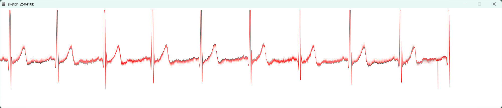

# AD8232を使った心拍モニタ

## 部品
- [AD8232 ecg測定モジュール](https://ja.aliexpress.com/item/1005002084666949.html?spm=a2g0o.order_list.order_list_main.11.5459585aBBUmdM&gatewayAdapt=glo2jpn)
- [Bluepill Plus](https://ja.aliexpress.com/item/1005006110046576.html?spm=a2g0o.order_list.order_list_main.47.5459585aBBUmdM&gatewayAdapt=glo2jpn)
- [交換用のパッド](https://ja.aliexpress.com/item/1005006820753247.html?spm=a2g0o.order_list.order_list_main.4.5459585aBBUmdM&gatewayAdapt=glo2jpn)

## 接続
パッド接続ケーブルはイヤホン端子を切断して基板にはんだ付けしました
- RA端子(赤)を右わきの下
- LA端子(緑)を左わきの下
- RL端子(黄)を右わき

Bluepillとの接続
- GNDとGND
- 3.3vと3V3
- OUTPUTとA0
- LO-とA1
- LO+とA2

## ソフト
基本的には[sparkfun](https://learn.sparkfun.com/tutorials/ad8232-heart-rate-monitor-hookup-guide)の通りだけど、サンプルレートを上げないときれいな波形が見れなかった

ArduinoIDEのシリアルプロッタは横軸サンプル数が少なすぎてダメ

Processiongで240spsで表示するときれいな波形が見られた