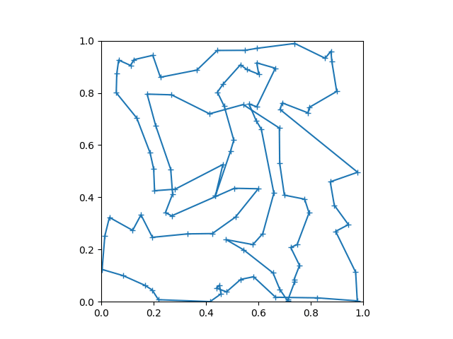

# ゼロからできる MCMC メモ

[ゼロからできる MCMC](https://www.kspub.co.jp/book/detail/5201749.html) のコードです。

Gaussian_HMC_multi_variables.cpp は公式サンプルからちょっとだけ変更したもの。  
Gaussian_HMC_multi_variables.py は試しに Python に翻訳したもの。

replica_salesman.c は公式サンプルからちょっとだけ変更したもの。  
replica_salesman.py は Python に翻訳したもの。  
最初は意味を変えずに翻訳したものです(d3eabd0770cdf534239c21303850cc511eec94d7) 。  
次に、レプリカ交換を並列実行可能とするために、チクタクで隣と交換するだけにした。

↓は 400万回まで計算した経過
