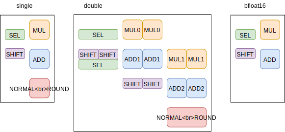

# 多機能モジュールを読みやすく記述したい

複数の機能を持つモジュールを SystemVerilog で記述します。  
各機能が排他利用であるときは共有リソースをなるべく多くしたいのですが、そのまま記述すると各機能がファイル中にとびとびになってとっても読みにくい。  
少しでもわかりやすく書けないかと思って試してみました。  
ここでは単精度FMAと倍精度FAMとbfloat16のFMA (積の累積に特化) の 3機能を持つモジュールの例にして試してみます。

ただ、目的が目的だけに、各機能のインプリは結構いい加減です。  
そして、記述面でもまだまだ工夫する必要を感じました。

では本題。

まず、各機能をそれぞれインプリします。  
このとき、共有サブモジュールのインタフェースは最初にしっかりと検討しておくことが必要です。  
これを怠った結果、あとでたくさん修正する必要に迫られました。  
とりあえずこんな感じで個別に…



それぞれの動作確認は↓。数分程度?時間かかります。実行には Verilator と berkeley-testfloat が必要です。

```
$ make -f Makefile.fmas
$ ./berkeley-testfloat-3/build/Linux-x86_64-GCC/testfloat_gen -f32_mulAdd | ./sim/Vfma > log
$ make -f Makefile.fmad
$ ./berkeley-testfloat-3/build/Linux-x86_64-GCC/testfloat_gen -f64_mulAdd | ./sim/Vfma > log
$ make -f Makefile.fmab
$ ./berkeley-testfloat-3/build/Linux-x86_64-GCC/testfloat_gen -f32_mulAdd | ./sim/Vfma > log
```

次はサブモジュールの共有化。 



今までサブモジュールを置いてあった場所には、インタフェースを struct にコピーして最上位階層まで引き出すだけのダミーを配置します。  
そして、最上位階層で共有モジュールの実体と接続します。  
日本語で説明するより ```fma_top.sv``` を見てもらったほうが早いかと。

そして、それぞれの機能の確認は↓。

```
$ make TB=fmad_tb.cpp
$ ./berkeley-testfloat-3/build/Linux-x86_64-GCC/testfloat_gen -f32_mulAdd | ./sim/Vfma > log
$ make TB=fmas_tb.cpp
$ ./berkeley-testfloat-3/build/Linux-x86_64-GCC/testfloat_gen -f64_mulAdd | ./sim/Vfma > log
$ make TB=fmab_tb.cpp
$ ./berkeley-testfloat-3/build/Linux-x86_64-GCC/testfloat_gen -f32_mulAdd | ./sim/Vfma > log
```

