### キャッシュの補足
#### キャッシュメモリとは・Full Associative キャッシュ

#### Direct Map キャッシュ・Set Associative キャッシュ

#### アクセス方法

#### 書き込み

### キャッシュコヒーレンシについての補足

CPU にはキャッシュメモリがあり、RAM 上の一部のコピーを保持しています。  
そのため、PL とのデータが正しく転送できない場合があります。

#### CPU から PL への転送

Dirty (CPUからの書き込みが Cache までしか反映されず Memory に古いデータがある) 状態では正しくデータが転送できない。

#### PL から CPU への転送

転送データのアドレスがすでにキャッシュされていると正しくデータが転送できない。

Dirty なキャッシュがあるときは注意が必要。

#### ACP が使えると便利

