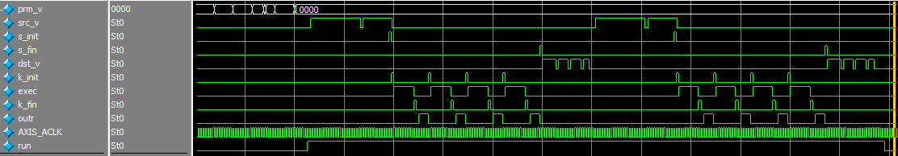
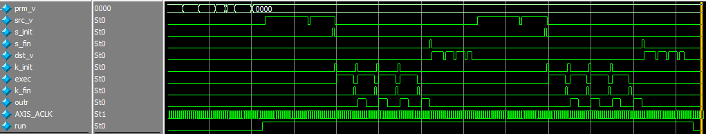

# 5 PL 上の 行列乗算器(2)を使う

PL に作った行列乗算器を使って計算します。  
IP は 行列メモリ、入力データバッファ、出力データバッファを持ち、それぞれ dma を使ってアクセスします。

IP の行列乗算機能は 4回目と同じです。  
疑似コードを書くとこんな感じですが、`k` のループと `oa` のループがパイプライン動作するようになりました。

```
    for(int j=0; j<4; j++){
      int sum[4] = {};
      for(int k=0; k<8; k++){
      	int d = in_buf[j][k];
# parallel for
        for(int i=0; i<4; i++){
          sum[i] += matrix[i][k] * d;
        }
      }
      for(int oa=0; oa<4; oa++){
        out_buf[j][oa] = sum[oa];
      }
    }
```

シミュレーション波形で見るとこんな感じです。

変更前



変更後



行列乗算モジュールの実装はかなりいい加減なので流用することはあまり考えないでください。

## RTL シミュレーションを実行する

SystemC + Verilator とコラボした協調検証環境(全部手彫り)です。

##### ツールのバージョン

- g++ (Ubuntu 7.3.0-27ubuntu1~18.04) 7.3.0
- Verilator 4.010 2019-01-27 rev UNKNOWN_REV
- SystemC 2.3.3-Accellera

##### 環境

テストベンチは ```tb.cpp``` です。だらだら長く書いていますが、まぁ、見た通りです。  
レジスタ設定のための AXI Lite 書き込みと、データ読み書きの AXIストリームデータを生成しています。  
流してみるのが早いと思います。

##### 実行法

```
$ make
$ ./sim/Vtop
```

## FPGA はお休み


