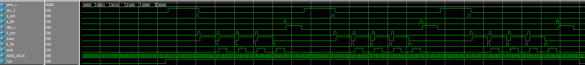
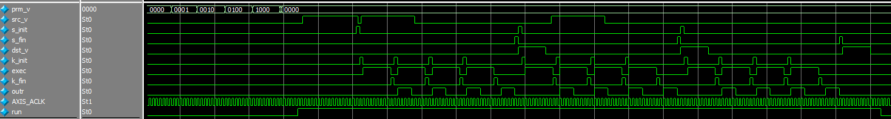

# 7 PL 上の 行列乗算器(4)を使う

PL に作った行列乗算器を使って計算します。  
IP は 行列メモリ、入力データバッファ、出力データバッファを持ち、それぞれ dma を使ってアクセスします。

IP の行列乗算機能は 4,5,6回目と同じです。  
今回はデータ転送(`src_v,dst_v`)と演算(`exec`)をパイプライン動作させます。

シミュレーション波形で見るとこんな感じです。

変更前



変更後



行列乗算モジュールの実装はかなりいい加減なので流用することはあまり考えないでください。

## RTL シミュレーションを実行する

Verilator を使用した協調検証環境(全部手彫り)です。

##### ツールのバージョン

- g++ (Ubuntu 7.3.0-27ubuntu1~18.04) 7.3.0
- Verilator 4.010 2019-01-27 rev UNKNOWN_REV

##### 環境

テストベンチは ```tb.cpp``` です。だらだら長く書いていますが、まぁ、見た通りです。  
レジスタ設定のための AXI Lite 書き込みと、データ読み書きの AXIストリームデータを生成しています。  
流してみるのが早いと思います。

##### 実行法

```
$ make
$ ./sim/Vtop
```

## FPGA で実行する

### ブロックデザインを作る

[NahiViva](https://github.com/tokuden/NahiViva) で再現できるようにしました。説明は [こっち](http://nahitafu.cocolog-nifty.com/nahitafu/2019/05/post-2cfa5c.html) を見た方が良いかも。  
次のディレクトリ ```ArtyZ7/7_gemm4/``` に必要なファイルをダウンロードして、```open_project_gui.cmd``` 実行でプロジェクトが再現されます。

#### 手動でやるなら

1. Vivado でソースファイル （```Src/7_gemm4/top.v, buf.sv, control.sv, core.sv, ex_ctl.sv, loop_lib.sv``` ）を開く
2. ブロックデザインの中に ```top``` を RTLモジュールとして追加する
3. ほかの部品を ```design_1.pdf``` を参考に追加して結線する
4. PL のクロックは 100MHz
5. アドレスマップは下記参照

| master | slave module | Start Address | End Address |
| ------ | ------------ | ------------- | ----------- |
| PS7    | top          | 4000_0000     | 4000_0FFF   |
|        | AXI DMA      | 4040_0000     | 4040_0FFF   |
| DMA    | DDR          | 0000_0000     | 1FFF_FFFF   |

ACP を使うときには AxCACHE を 1111 or 1110 にする必要があるようなので ```Constant IP``` を使って 1111 を入れています。  
詳しい話は [ここ](https://qiita.com/ikwzm/items/b2ee2e2ade0806a9ec07) が参考になります。  
あと、PL の設定で ```Tie off AxUSER``` にチェックを入れています。

### Petalinux を作る

Vivado でビットストリーム込みの xsa ファイルをエクスポート、```petalinux_dma/project_1```にコピーして、

```
$ source /opt/pkg/petalinux/settings.sh
$ petalinux-create --type project --template zynq --name petalinux_dma
$ cd petalinux_dma/
$ petalinux-config --get-hw-description=./project_1
```

menuconfig の画面で ```Image Packaging Configuration ->  Root filesystem type -> EXT(SD...)``` を選択する。

DMA 転送に使うバッファ用に [udmabuf](https://github.com/ikwzm/udmabuf/blob/master/Readme.ja.md) を作る。

```
$ petalinux-create -t modules --name udmabuf --enable
$ petalinux-build -c rootfs
```

ダウンロードしたファイルで ```project-spec/meta-user/recipes-modules/udmabuf/files/``` を置き換えて、

```
$ petalinux-build -c udmabuf
```

続けて、udmabuf の設定をして、DMA と mem のアドレス空間を uio にする。  
DMA に ```dma-coherent``` を設定する。  
デバイスツリーに ```dma-coherent``` 付きで udmabuf を追加する。  
具体的には ```ArtyZ7/7_gemm4/system-user.dtsi``` で ```project-spec/meta-user/recipes-bsp/device-tree/files/system-user.dtsi``` を上書きして、

```
$ petalinux-build
```

続けて、

```
$ petalinux-package --boot --force --fsbl images/linux/zynq_fsbl.elf --fpga images/linux/system.bit --u-boot
```

生成物は ```images/linux/BOOT.bin, image.ub, rootfs.tar.gz``` です。

BOOT.bin,  image.ub を SDカード(FAT32) にコピーする。

```
$ cp images/linux/BOOT.bin /media/tom01h/BOOT
$ cp images/linux/image.ub /media/tom01h/BOOT
```

rootfs.tar.gz を SDカード(ext4) にコピーする。

```
$ sudo tar xvf images/linux/rootfs.tar.gz -C /media/tom01h/${mount_point}
$ sudo sync
```

### プログラムをコンパイルする

ホストPCでクロスコンパイルして SDカード(FAT32) にコピーする。

```
$ ${SDK path}/gnu/aarch32/nt/gcc-arm-linux-gnueabi/bin/arm-linux-gnueabihf-gcc.exe  test.c -o test
```

### 実行する

SD カードを挿入して Zynq をブートします。

login,password 共に root でログインできます。

```
root@petalinux_dma:~# mount /dev/mmcblk0p1 /mnt/
root@petalinux_dma:~# /mnt/test
```


