### 仮想記憶についての補足
#### 仮想記憶とは

CPU には MMU があり、仮想アドレス空間 (ユーザプロセス毎) と物理アドレス空間 (実際のメモリのアドレス) のアドレス変換をします。

#### DMA 転送

例えば、黄色プロセスがアドレス2のデータを転送したくても物理アドレス (5) がわかりません。

#### 厳密にいうと

物理アドレスを知る方法もあるにはあるが…

#### IOMMU が使えると便利

