### 仮想記憶についての補足

#### 仮想記憶とは

CPU には MMU があり、仮想アドレス空間 (ユーザプロセス毎) と物理アドレス空間 (実際のメモリのアドレス) のアドレス変換をします。

#### DMA 転送

例えば、黄色プロセスがアドレス2のデータを転送しくても物理アドレス (5) がわかりません。  
MMU には物理アドレスでメモリにアクセスするため、このままでは転送できません。  
MMU 管理外のメモリ (6, 7 番地) を準備して、CPU で転送してから DMA を実行します (逆もある)。

#### IOMMU が使えると便利

