# Petalinux と DMA を使うサンプル実装

Zynq 上で Petalinux と DMA を使うサンプル実装です。  
Linux 上のユーザプログラムと PL 上の自作回路の間でデータのやり取りをします。

### 誰のため？

数年前の自分が欲しかったものを纏めてみました。想定は、

- Verilog はできる
- Linux と高級言語はちょっとだけは…
- FPGA 使ってみたい
  - FPGA に計算させたい
  - Lチカに毛の生えた程度の事は試してみた
  - まだやりたいこととのギャップを埋めがたい…

こんな人、自分以外にいるのかなぁ？

[tiny-dnn-fpga アクセラレータ](https://github.com/tom01h/tiny-dnn-fpga) を作る時に、アクセラレータ本体以外で必要になった情報たちです。  
あっちはかなり巨大になってしまったので、本体以外の部分を切り出してみました。

### 概要

下にあるの 2回目のやり方で CPU から uio を使って PL のデータを 1個づつ読み書きしても良いのですが、この方法はとっても遅いです。  
でも、Linux のユーザプログラムは仮想アドレス空間で動いているので、PL から直接アクセスする事が出来ません。

そのためにまず、 [udmabuf](https://github.com/ikwzm/udmabuf/blob/master/Readme.ja.md)  を使って、ユーザプログラムと PL のどちらからでもアクセスできるメモリ領域を PS につながった DRAM 上に準備します。  
そして、ユーザプログラムは udmabuf の領域にデータをコピーし、PL 上の DMA を使って PL 上の BRAM との間のデータ転送をします。

その際に少しでもデータ転送速度を上げるため、Zynq の持つ ACP 機能を使っています。  
PL から DRAM をアクセスしたときにも CPU の持つキャッシュメモリとのコヒーレンシが保証されます。  
CPU のレベル 2 キャッシュを PL と共有可能なため、データ転送速度が向上します。

### 目次

[1回目](https://github.com/tom01h/TIL/tree/master/petalinux_dma/Doc/1_Boot): Petalinux のブート

[2回目](https://github.com/tom01h/TIL/tree/master/petalinux_dma/Doc/2_uio): PL 上の BRAM に uioを使ってアクセスする

[3回目](https://github.com/tom01h/TIL/tree/master/petalinux_dma/Doc/3_dma): PL 上の BRAM に DMA を使ってアクセスする

[4回目](https://github.com/tom01h/TIL/tree/master/petalinux_dma/Doc/4_gemm1): PL 上の 行列乗算器(1)を使う

[5回目](https://github.com/tom01h/TIL/tree/master/petalinux_dma/Doc/5_gemm2): PL 上の 行列乗算器(2)を使う

[6回目](https://github.com/tom01h/TIL/tree/master/petalinux_dma/Doc/6_gemm3): PL 上の 行列乗算器(3)を使う

[7回目](https://github.com/tom01h/TIL/tree/master/petalinux_dma/Doc/7_gemm4): PL 上の 行列乗算器(4)を使う

Petalinux の使い方は [ZYBO (Zynq) 初心者ガイド](https://qiita.com/iwatake2222/items/966f252f6ca954aff08b) がとってもわかりやすいので、そのまま真似をします。  
1回目は上記の 8回目と9回目の一部をなぞるだけです。2回目は16回目のチョイ変です。  
3回目に [udmabuf](https://github.com/ikwzm/udmabuf/blob/master/Readme.ja.md) を使って DMA 転送します。  
4回目は DMA 転送を使って、PL 上の行列乗算器で計算します。色々と工夫の余地を残した遅さです。  
5回目は アクセラレータ IP 内部の高速化です。今回は FPGA はお休みしてシミュレーションだけ。  
6回目はデータ転送を 2ワード(=64bit)/サイクル として、データ転送時間を半減します。今回も FPGA はお休みしてシミュレーションだけ。  
7回目はデータ転送と演算をパイプライン動作させます。

基本的には [Arty Z7(20)](http://akizukidenshi.com/catalog/g/gM-11921/) で進めて行きますが、たまに [CORA Z7(07S)](http://akizukidenshi.com/catalog/g/gM-13489/) とか [Z-turn](https://www.mouser.jp/ProductDetail/MYIR/MYS-7Z020-C-S?qs=sGAEpiMZZMspCjQQiuQ1fFTDrDpp2YD1BAGzL8zwYgeMsEw87QCFMw==) とか Ultra96 のサンプルも作る予定。  
PL 部の自作回路はすべて Verilog で書くので HLS も SDSoC も使いません。

### ツールバージョン (Ultra96)

Vivado 2018.2

Petalinux 2018.2

udmabuf 1.4.0

### ツールバージョン (それ以外)

Vivado 2019.1

Petalinux 2019.1

udmabuf 1.4.1