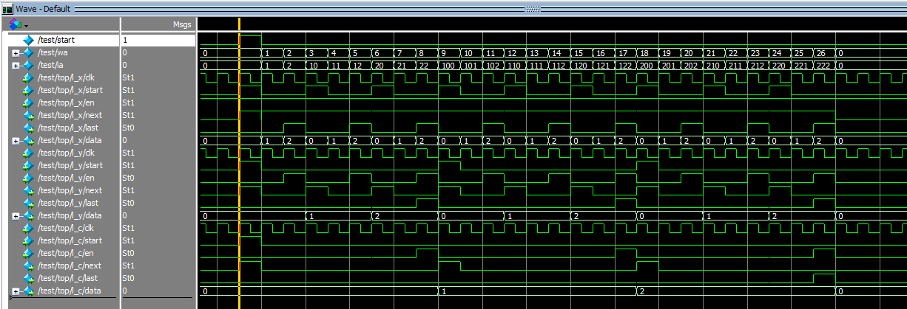

# Verilog で多重 loop を読みやすく記述する

多重の for loop で最内ループを 1サイクルピッチで実行するための Verilog 記述を、出来るだけ読みやすくする記述を考えてみました。  
次のような SystemC のコード(未検証)を 読みやすい Verilog で記述したいと思います。

```c++
    if(start.read()){
      for(int c=0; c<3; c++){
        for(int y=0; y<3; y++){
          for(int x=0; x<3; x++){
            wa.write(c*9+y*3+x);
            ia.write(c*100+y*10+x);
            wait();
          }
        }
      }
      last.write(1);
      wait();
      last.write(0);
    }
```

Verilog で書くとこんな感じ。  
Verilog なので書く順番は関係ないですが、C で書くときとそろえると読みやすくなるかと思います。  
Verilog Mode を使っても、自動でインデントが付かないのがいまいちですけど…

```verilog
   assign last = last_c;

   loop l_c(.fin(4'd2), .data(c[3:0]), .clk(clk), .rst(rst), .start(start),  .en(last_y), .next(next_c), .last(last_c));
   loop l_y(.fin(4'd2), .data(y[3:0]), .clk(clk), .rst(rst), .start(next_c), .en(last_x), .next(next_y), .last(last_y));
   loop l_x(.fin(4'd2), .data(x[3:0]), .clk(clk), .rst(rst), .start(next_y), .en(1'b1),   .next(next_x), .last(last_x));

   assign wa = c*9+y*3+x;
   assign ia = c*100+y*10+x;

```

Verilog なので書く順番は関係ないですが、C で書くときとそろえると読みやすくなるかと思います。  
Verilog Mode を使っても、自動でインデントが付かないのがいまいちですけど…

内側のループが終わった時だけ外側のループを実行するために、last と en をつないでいます。  
内側のループが終わった後に、もう一度繰り返すかを外側のループから伝えるのが next と start の接続です。

流してみた波形がこんな感じ。



